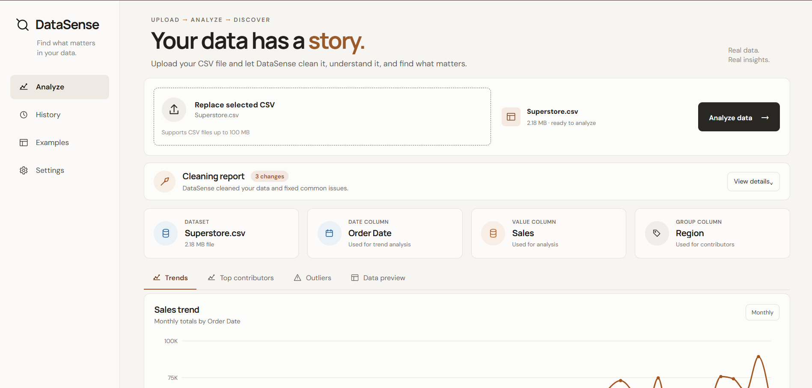
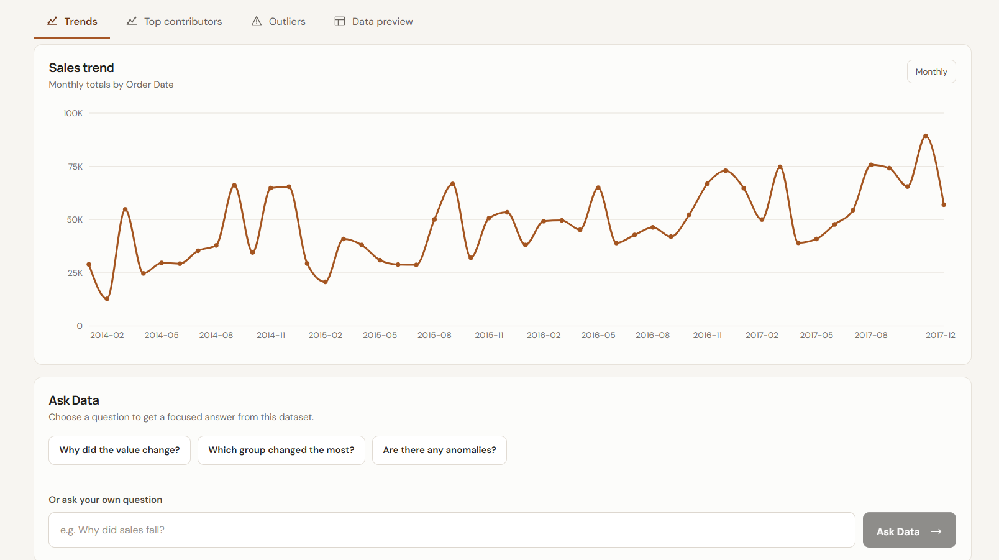
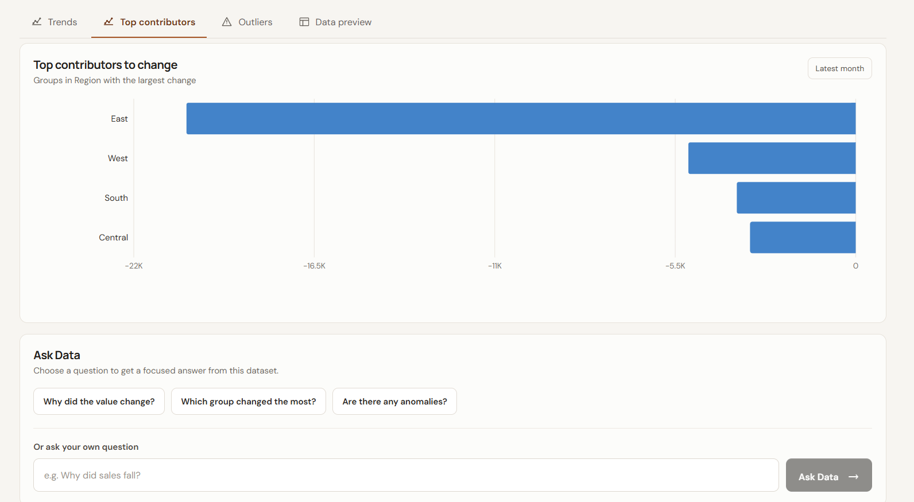
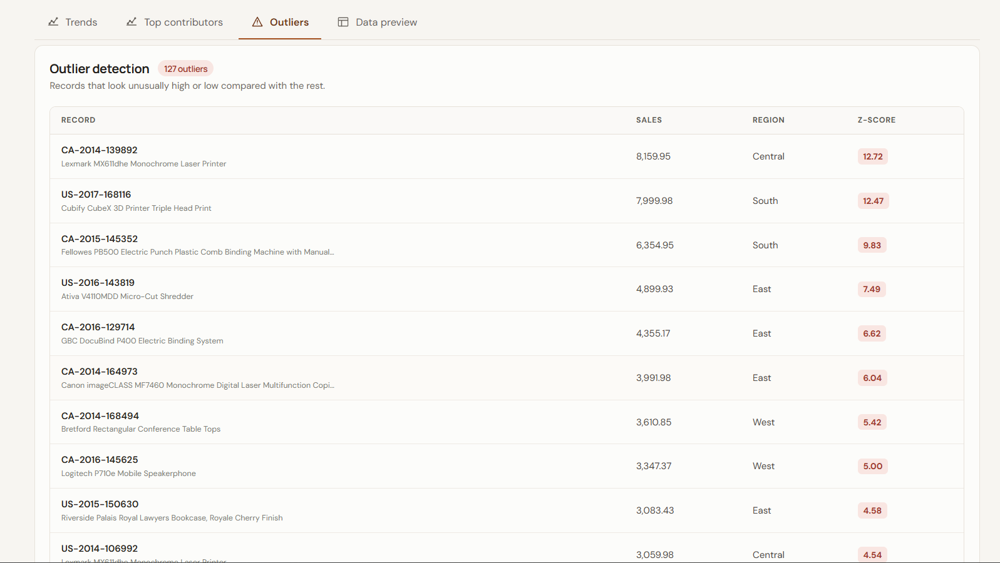
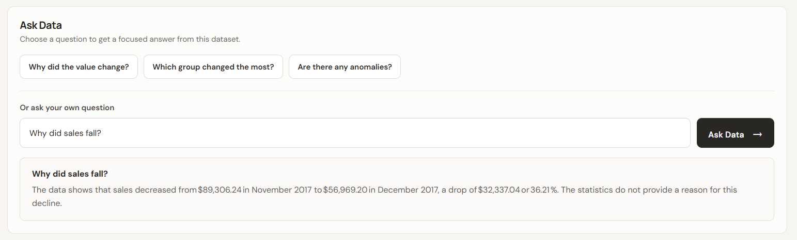
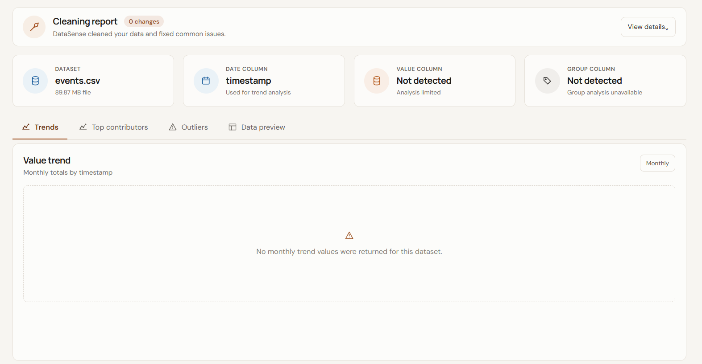

# DataSense

> An intelligent data analytics platform that turns raw CSV files into cleaned insights, visual analytics, anomaly detection, and grounded natural-language answers.

## Overview

DataSense is a data analytics application designed to make exploratory analysis easier for business and retail datasets.

Users can upload a CSV file and DataSense automatically:

- Detects important columns
- Cleans and normalizes the dataset
- Identifies dates, values, and grouping dimensions
- Generates statistical insights
- Visualizes trends
- Finds top contributors
- Detects anomalies
- Answers supported business questions
- Accepts natural-language wording for supported question intents
- Uses an LLM only to explain trusted statistics generated by the DataSense analysis engine

The goal is to combine traditional data analysis with natural-language interaction while keeping answers grounded in the underlying dataset.

---

## Key Features

### CSV Analysis

Upload a CSV dataset and automatically generate an analysis based on the available columns.

DataSense dynamically identifies:

- Date columns
- Business/value columns
- Group/category columns
- Numeric fields
- Categorical fields

It is designed to work with different dataset schemas instead of relying on one fixed column structure.

### Data Cleaning

The cleaning pipeline handles tasks such as:

- Type inference
- Date normalization
- Currency/value normalization
- Category normalization
- Missing/invalid values
- Numeric conversion

### Analytics Dashboard

The dashboard provides:

- Dataset summary
- Date information
- Value column information
- Group column information
- Trend analysis
- Top contributors
- Outlier analysis
- Data preview
- Cleaning report

### Anomaly Detection

DataSense detects unusual observations using statistical analysis.

The current anomaly detection implementation uses a z-score based approach with:

```text
|Z| >= 3
```

### Ask Data

DataSense provides supported business-question intents such as:

- Why did the value change?
- Which group changed the most?
- Are there any anomalies?

Users can type natural-language questions that map to these supported intents.

Examples:

```text
Why did sales fall?
Which region changed the most?
Which category grew the most?
Were there unusual sales?
```

Questions requiring unsupported analysis are handled with a safe fallback instead of an invented answer.

### Grounded LLM Answers

Natural-language answers are generated using Groq.

The LLM does not receive the raw CSV as its source of truth. Instead, DataSense follows this architecture:

```text
CSV Dataset
    ↓
Data Cleaning
    ↓
Data Analysis
    ↓
Trusted Statistics
    ↓
Question Intent Detection
    ↓
Relevant Statistics
    ↓
Groq LLM
    ↓
Grounded Natural-Language Answer
```

The LLM is used to explain statistics that have already been calculated by the DataSense analysis engine.

This separation helps reduce unsupported explanations and keeps the numerical source of truth in the deterministic analysis layer.

If the available data cannot reliably answer a question, DataSense returns a safe fallback instead of fabricating an answer.

---

## Supported Question Intents

The current question engine supports three primary analytical intents.

### 1. Why did the value change?

Identifies the latest and previous time periods and calculates:

- Latest value
- Previous value
- Absolute change
- Percentage change

### 2. Which group changed the most?

Compares group-level changes between the latest and previous time periods.

### 3. Are there any anomalies?

Reports unusual observations detected by the anomaly detection system.

### Unsupported Questions

Questions that require analysis not currently provided by DataSense are rejected safely.

For example:

```text
What will sales be next year?
```

DataSense does not attempt to invent a forecast when forecasting statistics are not available.

---

## Tech Stack

### Backend

- Python
- FastAPI
- Pandas
- Pydantic
- Chardet
- Groq API

### Frontend

- React
- Vite
- Recharts
- JavaScript
- CSS

### AI / LLM

- Groq
- `openai/gpt-oss-20b`

### Development

- VS Code
- Git
- GitHub
- Swagger / OpenAPI

---

## Project Structure

```text
DataSense/
│
├── backend/
│   ├── app/
│   │   ├── analysis/
│   │   ├── api/
│   │   ├── cleaning/
│   │   ├── llm/
│   │   ├── main.py
│   │   ├── question_cache.py
│   │   └── question_intent.py
│   │
│   ├── tests/
│   ├── requirements.txt
│   ├── test_groq.py
│   └── test_groq_client.py
│
├── frontend/
│   ├── public/
│   ├── src/
│   │   ├── assets/
│   │   ├── App.jsx
│   │   ├── App.css
│   │   └── index.css
│   ├── package.json
│   └── vite.config.js
│
├── benchmarks/
│   ├── run_benchmark.py
│   ├── benchmark_results.json
│   ├── benchmark_manifest.json
│   ├── typing_mismatches.csv
│   └── results.md
│
├── docs/
│   ├── analysis_rules.md
│   ├── cleaning_rules.md
│   ├── architecture.md
│   ├── design_decisions.md
│   ├── question_answering.md
│   ├── benchmark_methodology.md
│   └── limitations.md
│
├── .gitignore
└── README.md
```

---

## Running DataSense Locally

### 1. Clone the repository

```bash
git clone https://github.com/Ishwar2227/DataSense.git
cd DataSense
```

### 2. Backend Setup

Create a virtual environment:

```bash
python -m venv .venv
```

On Windows with Git Bash:

```bash
source .venv/Scripts/activate
```

On Windows PowerShell:

```powershell
.venv\Scripts ctivate
```

Install backend dependencies:

```bash
pip install -r backend/requirements.txt
```

### 3. Configure Groq

Create:

```text
backend/.env
```

Add:

```env
GROQ_API_KEY=your_groq_api_key_here
```

Do not commit this file.

The repository's `.gitignore` already excludes `.env` files.

### 4. Start the Backend

From the project root:

```bash
cd backend
uvicorn app.main:app --reload
```

The API will be available at:

```text
http://127.0.0.1:8000
```

Swagger documentation:

```text
http://127.0.0.1:8000/docs
```

### 5. Start the Frontend

Open another terminal:

```bash
cd frontend
npm install
npm run dev
```

Then open the local Vite URL shown in the terminal.

---

## Security

API keys and local development environments are intentionally excluded from version control.

The repository ignores:

```text
.env
.venv/
node_modules/
dist/
__pycache__/
```

Large local testing datasets are also excluded from the repository.

Never commit:

- API keys
- `.env` files
- local virtual environments
- generated build files
- large benchmark datasets

---

## Phase 5 Benchmark Results

DataSense was benchmarked against **15 retail/e-commerce and related datasets**.

### Final Benchmark

| Metric | Result |
|---|---:|
| Datasets evaluated | 15 |
| Valid insights | 14 |
| Insufficient datasets | 1 |
| Pipeline errors | 0 |
| Typing accuracy | 88.61% |
| Typing cases | 140 / 158 |
| Datasets with cleaning changes | 4 |
| Total cleaning changes | 14 |
| Average runtime | 8.527 seconds |

One dataset, `events.csv`, was classified as insufficient for the current analysis pipeline because it did not provide a usable combination of business value and grouping information.

### Important Note

The 88.61% typing accuracy is a Phase 5 engineering benchmark, not a universal accuracy guarantee for arbitrary CSV files.

The cleaning-change count reports observed changes during the benchmark. It is **not** a percentage of all possible data-quality issues because the benchmark does not provide complete ground truth for every potential cleaning problem.

Full methodology is documented in:

```text
docs/benchmark_methodology.md
```

---

## Testing

DataSense has been tested with multiple datasets, including:

- Superstore
- Stores
- UK Online Retail
- DMart sample data
- The Office dataset
- Multiple additional Phase 5 benchmark datasets

Testing covered:

- Dynamic column detection
- Data cleaning
- Trend analysis
- Contributor analysis
- Outlier detection
- Fixed question intents
- Natural-language question wording
- Unsupported-question fallback
- Missing-data fallback
- Large-dataset question caching
- Insufficient-data handling
- Cross-dataset benchmark validation

---

## Screenshots

### Dashboard

The main DataSense dashboard automatically profiles the uploaded dataset and presents key statistics, trends, contributors, and data-quality information.

### Analytics

DataSense provides trend analysis, contributor analysis, and outlier detection using the detected business and grouping columns.
- Trends


- Top contributors


- Outliers


### Ask Data
Users can ask supported business questions in natural language. DataSense calculates the underlying statistics deterministically and uses the LLM only to explain those trusted results.


### Insufficient Data Handling
When the uploaded dataset does not contain the information required for an analysis, DataSense clearly reports the limitation instead of generating unsupported results.


---
## Demo

A short walkthrough of DataSense, showing the complete workflow from CSV upload and analysis to the dashboard and Ask Data.

[▶️ Watch the DataSense Demo](https://youtu.be/34KMxPOt8VU)

---
## Known Limitations

The current system has several intentional limitations:

- CSV is the current supported input format
- Type inference is heuristic and not perfect
- Automatic value/group selection can occasionally be ambiguous
- Time-based analysis requires a usable date column
- Trend analysis is currently monthly
- Ask Data supports a fixed set of analytical intents
- The system does not perform general causal inference
- Anomaly detection currently uses a z-score rule
- Large datasets can require significant memory and processing time
- The current benchmark is limited to 15 datasets
- Production authentication, authorization, rate limiting, and other security hardening are not yet implemented

For the complete list, see:

```text
docs/limitations.md
```

---

## Documentation

Detailed project documentation is available under `docs/`:

| Document | Purpose |
|---|---|
| `analysis_rules.md` | How analytical columns and insights are selected |
| `cleaning_rules.md` | Data cleaning and type-inference behavior |
| `architecture.md` | System architecture and component responsibilities |
| `design_decisions.md` | Major engineering and product decisions |
| `question_answering.md` | Ask Data and grounded LLM architecture |
| `benchmark_methodology.md` | Phase 5 benchmark methodology and results |
| `limitations.md` | Known limitations and current product boundaries |

---

## Current Project Status

### Phase 1 — Backend Foundation

Completed.

### Phase 2 — Cleaning and Analysis

Completed.

### Phase 3 — Frontend Dashboard

Completed.

### Phase 4 — Grounded Data Q&A

Completed.

Introduced:

- Question statistics
- Intent detection
- Groq integration
- Grounded answers
- Safe fallbacks
- Question-stat caching
- Multiple dataset validation

### Phase 5 — Benchmarking

Completed.

Introduced:

- 15-dataset benchmark pool
- Typing-accuracy evaluation
- Cleaning-change tracking
- Runtime measurement
- Insufficient-data validation
- Benchmark artifacts and methodology

### Phase 6 — Polish, Documentation, and Deployment

In progress.

Current work includes:

- UI state validation
- Complete technical documentation
- README refinement
- Demo preparation
- Production deployment
- Final deployed end-to-end testing

---


## Design Principle

DataSense follows a simple principle:

> **The analytics engine calculates. The LLM explains.**

The model should not be responsible for discovering facts directly from raw data when deterministic analysis can provide those facts first.

This separation makes the system easier to validate and helps keep natural-language answers grounded in measurable statistics.

---

## Future Direction

Potential future improvements include:

- More open-ended analytical questions
- Additional analytical methods
- More advanced anomaly detection
- Additional file formats
- User-selectable analytical dimensions
- Persistent datasets and history
- Authentication and multi-user support
- Production monitoring and security hardening
- Further benchmark expansion
- Performance optimization

These are future directions and are not represented as current capabilities.
